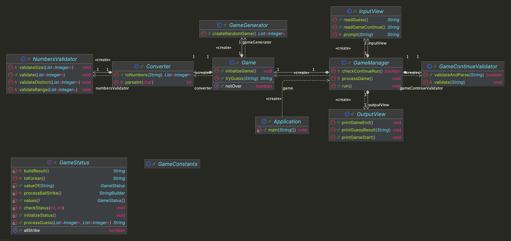

# java-baseball-6


---

# 프로젝트 개요

## 프로젝트 구조

```plaintext
└── baseball
    ├── Application.java
    ├── controller
    │ └── GameManager.java
    ├── domain
    │ └── Game.java
    ├── handler
    │ └── ErrorHandler.java
    └── view
        ├── InputView.java
        └── OutputView.java
```


---

## 프로젝트 다이어그램




---

# 구현할 기능 목록

## 🗂️ Domain

### Game
- [ ] 맞춰야할 랜덤 숫자 3개를 생성한다.
- [ ] 입력한 숫자의 볼/스트라이크 결과를 계산한다.
- [ ] 입력한 숫자가 정답과 일치하는 지 확인한다.


---

## 👀 View

### InputView
- [ ] 입력 기능을 처리한다.
  - [ ] 숫자 3개를 입력받는다.
  - [ ] 게임 진행 여부를 입력받는다.

### OutputView
- [ ] 출력 기능을 처리한다.
  - [ ] 게임 시작 메시지를 출력한다.
  - [ ] 입력한 숫자의 볼/스트라이크 개수를 출력한다.
  - [ ] 게임 종료 메시지를 출력한다.


---

## 🕹️ Controller

### GameManager
- [ ] 게임 진행 과정을 처리한다.
- [ ] 입력받은 숫자 3개의 볼/스트라이크 개수를 계산해 출력하도록 한다.
- [ ] 입력받은 숫자 3개의 유효성을 검증한다.
  - [ ] [예외] 중복되는 숫자가 있는 경우, 예외를 발생시킨다.
  - [ ] [예외] 양수가 아닌 경우, 예외를 발생시킨다.
  - [ ] [예외] 숫자가 3개가 아닌 경우, 예외를 발생시킨다.
- [ ] 게임 재시작 여부의 유효성을 검증한다.
  - [ ] [예외] "1" 또는 "2"를 입력하지 않은 경우, 예외를 발생시킨다.


---

## 🛠 Handler

### ErrorHandler
- [ ] 잘못된 입력 시 IllegalArgumentException 예외를 발생시킨다.
