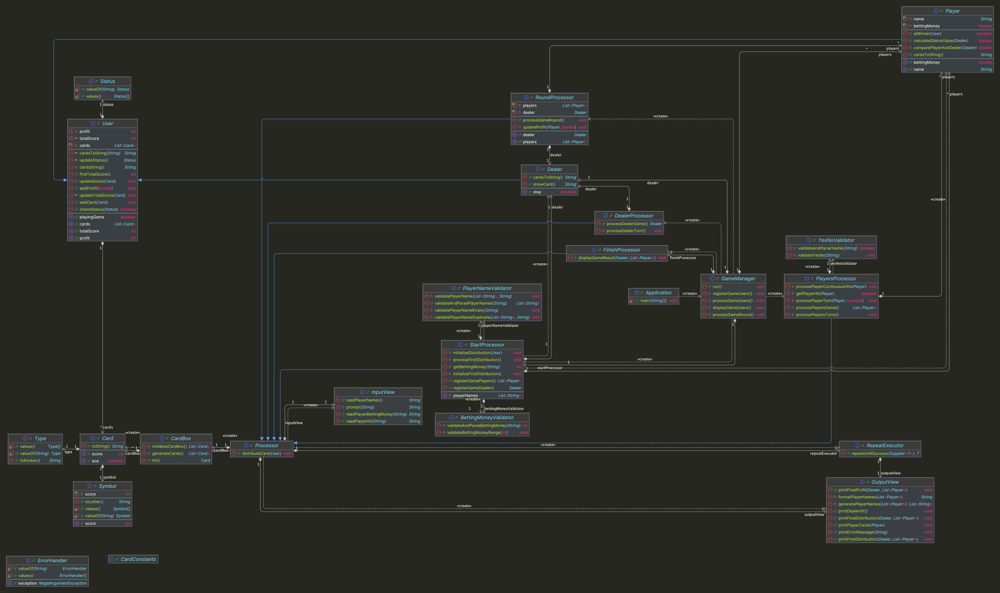

# java-blackjack


---

# 프로젝트 개요

## 프로젝트 구조

```plaintext
└── java
    └── blackjack
        ├── Application.java
        ├── controller
        │ ├── FinishProcessor.java
        │ ├── GameManager.java
        │ ├── Processor.java
        │ ├── StartProcessor.java
        │ └── user
        │     ├── DealerProcessor.java
        │     ├── PlayersProcessor.java
        │     └── RoundProcessor.java
        ├── domain
        │ ├── card
        │ │ ├── Card.java
        │ │ ├── CardBox.java
        │ │ ├── CardConstants.java
        │ │ ├── Symbol.java
        │ │ └── Type.java
        │ └── user
        │     ├── Dealer.java
        │     ├── Player.java
        │     ├── Status.java
        │     └── User.java
        ├── handler
        │ └── ErrorHandler.java
        ├── util
        │ └── RepeatExecutor.java
        ├── validator
        │ ├── BettingMoneyValidator.java
        │ ├── PlayerNameValidator.java
        │ └── YesNoValidator.java
        └── view
            ├── InputView.java
            └── OutputView.java
```


---

## 프로젝트 다이어그램




---

# 구현할 기능 목록

## 🗂️ Domain

### CardConstants
- [ ] 카드 관련 상수를 저장한다.

### CardBox
- [ ] 게임 카드 덱을 초기화한다.
- [ ] 카드 덱의 카드 1장을 반환한다.

### Card
- [ ] 카드의 이름을 반환한다.
- [ ] 카드의 점수를 반환한다.
- [ ] 에이스 카드 여부를 판단한다.

### Symbol
- [ ] 카드 상징 13가지 관련 정보를 처리한다.
  - [ ] 카드 상징 기호를 반환한다.
  - [ ] 카드 상징 점수를 반환한다.

### Type
- [ ] 카드 종류 4가지 관련 정보를 처리한다.
  - [ ] 카드 종류 한국어 명칭을 반환한다.

### User
- [ ] 게임 참가자가 보유한 카드 묶음 관련 정보를 처리한다.
  - [ ] 게임 참가자의 카드 묶음에 새로운 카드를 추가한다.
  - [ ] 게임 참가자의 카드 묶음 점수를 업데이트한다.
    - [ ] 에이스 카드가 있는 경우 가능한 카드 묶음 점수들을 고려한다.
      - [ ] 에이스 카드를 1로 취급하며 추가 카드를 받도록 한다.
      - [ ] 최종 수익 비율은 총 점수가 21을 초과하지 않는 한 에이스 카드를 10으로 취급해 계산한다.
  - [ ] 카드 묶음 점수에 따른 게임 참가자의 게임 참여 상태를 업데이트한다.

- [ ] 게임 참가자의 게임 참여 상태에 따라 현재 게임 참여 여부를 판단한다.

- [ ] 게임 참가자의 최종 수익 비율을 계산한다.
  - [ ] 딜러가 승리한 경우(BLACKJACK 또는 WIN) 최종 수익 비율을 계산한다.
    - [ ] 플레이어의 수익 비율은 -1.0이다.
    - [ ] 딜러 BLACKJACK, 플레이어 BLACKJACK 수익 비율은 0.0이다.
    - [ ] 딜러 BLACKJACK, 플레이어 WIN 수익 비율은 -1.0이다.
    - [ ] 딜러 WIN, 플레이어 WIN 수익 비율은 0.0이다.
    - [ ] 딜러 WIN, 플레이어 BLACKJACK 수익 비율은 1.5이다.
  
  - [ ] 딜러가 패배한 경우(BUST) 최종 수익 비율을 계산한다.
    - [ ] 게임에 남은 플레이어들의 수익 비율은 카드 묶음 점수와 상관없이 모두 1.0이다.
    - 
  - [ ] 딜러가 게임에 참여하고 있는 경우(PLAY) 최종 수익 비율을 계산한다.
    - [ ] 플레이어가 우승한 경우(BLACKJACK) 수익 비율은 1.5이다.
    - [ ] 플레이어가 우승한 경우(WIN) 수익 비율은 1.0이다.
    - [ ] 플레이어가 패배한 경우(BUST) 수익 비율은 -1.0이다.
    - [ ] 플레이어가 게임에 참여하고 있는 경우(PLAY)
      - [ ] 딜러와 플레이어의 총 점수를 비교해 점수가 더 큰 참가자를 우승자로 선정한다.
      - [ ] 딜러와 플레이에게 지급/차감하는 수익 비율은 1.0/-1.0이다.

- [ ] 최종 수익 비율을 바탕으로 게임 참가자의 최종 수익을 계산한다.


### Player
- [ ] 플레이어의 이름과 배팅 금액 정보를 처리한다.
- [ ] 플레이어의 게임 참여 상태에 따른 최종 수익 비율을 계산한다.
  - [ ] 플레이어가 승리하거나 패배하지 않은 경우, 플레이어와 딜러의 점수를 비교해 계산한다.

### Dealer
- [ ] 플레이어에게 공개할 카드 1장을 반환한다.
- [ ] 딜러의 카드 묶음 점수가 16이하인 경우, 한 장의 카드를 더 받는 여부를 확인한다.


### Status
- [ ] 게임 참여 상태 관련 정보를 처리한다.
  - [ ] BLACKJACK: 총 점수가 21이고, 카드 묶음이 2장으로 우승한 상태
  - [ ] WIN: 총 점수가 21로 우승한 상태
  - [ ] PLAY: 게임 참여를 계속하는 상태
  - [ ] BUST: 총 점수가 21을 초과하는 상태


---

## 👀 View

### InputView
- [ ] 입력 기능을 처리한다.
  - [ ] 게임에 참가할 사람의 이름을 입력받는다.
  - [ ] 게임에 참가하는 플레이어의 배팅 금액을 입력받는다.
  - [ ] 게임에 참가하는 플레이어의 카드 1장 추가 여부를 입력받는다.

### OutputView
- [ ] 출력 기능을 처리한다.
  - [ ] 에러 발생시 에러 관련 메시지를 출력한다.
  - [ ] 카드를 최초 배분한 게임 참가자의 카드 묶음을 출력한다.
  - [ ] 딜러가 추가로 카드 1장를 더 받는 경우를 출력한다.
  - [ ] 플레이어의 카드 묶음을 출력한다.
  - [ ] 카드를 최종 배분한 게임 참가자의 카드 묶음과 총 점수를 출력한다.
  - [ ] 게임 참가자의 최종 수익을 출력한다.


---

## 🕹️ Controller

### GameManager
- [ ] 블랙잭 게임 과정 전체를 관리한다.
  - [ ] 게임 참가자(딜러, 플레이어)를 등록한다.
  - [ ] 게임 참가자가 카드를 추가로 더 받도록 한다.
  - [ ] 게임 참가자가 보유한 카드 묶음의 결과를 계산한다.
  - [ ] 게임 참가자의 배팅 결과를 출력한다.

### Processor
- [ ] 게임 참가자의 게임 프로세스를 처리한다.
  - [ ] 참가자에게 한 장의 카드를 전달한다.

### StartProcessor
- [ ] 게임 참가자(딜러, 플레이어) 등록 프로세스를 처리한다.
  - [ ] 플레이어의 이름과 배팅 금액을 입력받고, 게임 참가자로 등록한다.
  - [ ] 딜러를 게임 참가자로 등록한다.
- [ ] 각 게임 참가자에게 카드 2장씩 배분한다.

### PlayersProcessor
- [ ] 플레이어에게 카드를 추가로 더 주는 프로세스를 처리한다.
  - [ ] 게임을 종료하지 않은 플레이어에게 카드를 거절할 때까지 추가로 준다.
  - [ ] 최초인 경우(카드 묶음을 보여준 적이 없으면), 카드를 추가로 받지 않더라도 플레이어의 카드 묶음을 보여준다.
  - [ ] 카드를 추가로 받지 않으면(카드 묶음에 변화가 없으면), 플레이어의 카드 묶음을 보여주지 않는다.

### DealerProcessor
- [ ] 딜러가 카드를 추가로 더 받는 프로세스를 처리한다.
  - [ ] 딜러가 게임에 참여하고 있다면, 딜러는 카드 1장을 추가로 받는다.

### RoundProcessor
- [ ] 게임 참가자(딜러, 플레이어) 카드 묶음 결과 계산 프로세스를 처리한다.
  - [ ] 플레이어에게 최종 수익 비율로 계산한 최종 배팅 금액을 지급/차감한다.
  - [ ] 딜러에게 최종 수익 비율로 계산한 최종 배팅 금액을 차감/지급한다.

### FinishProcessor
- [ ] 게임 참가자의 배팅 결과 출력 프로세스를 처리한다.
  - [ ] 게임 참가자의 카드 묶음을 보여준다.
  - [ ] 게임 참가자의 최종 수익을 보여준다. 


---

## ✅ Validator

### PlayerNameValidator
- [ ] 게임 플레이어 이름의 유효성을 검증한다.
  - [ ] 이름이 빈 공백인 경우, 예외를 발생시킨다.
  - [ ] 이름이 중복된 경우, 예외를 발생시킨다.

### BettingMoneyValidator
- [ ] 게임 배팅 금액의 유효성을 검증한다.
  - [ ] 금액이 숫자가 아닌 경우, 예외를 발생시킨다.
  - [ ] 금액이 양수가 아닌 경우, 예외를 발생시킨다.

### YesNoValidator
- [ ] 한 장의 카드를 더 받는 여부의 유효성을 검증한다.
  - [ ] `y` 또는 `n`가 아닌 경우, 예외를 발생시킨다.


---

## 🛠 Handler

### ErrorHandler
- [ ] 잘못된 입력 시 오류 메시지를 출력하고 재입력을 유도한다.
  - [ ] 잘못된 입력 시 IllegalArgumentException 예외를 발생시킨다.


---

## ⚙️ Util

### RepeatExecutor
- [ ] 입력이 성공할 때까지 재입력을 받는다.
  - [ ] IllegalArgumentException 예외 발생시 재입력을 받는다.
