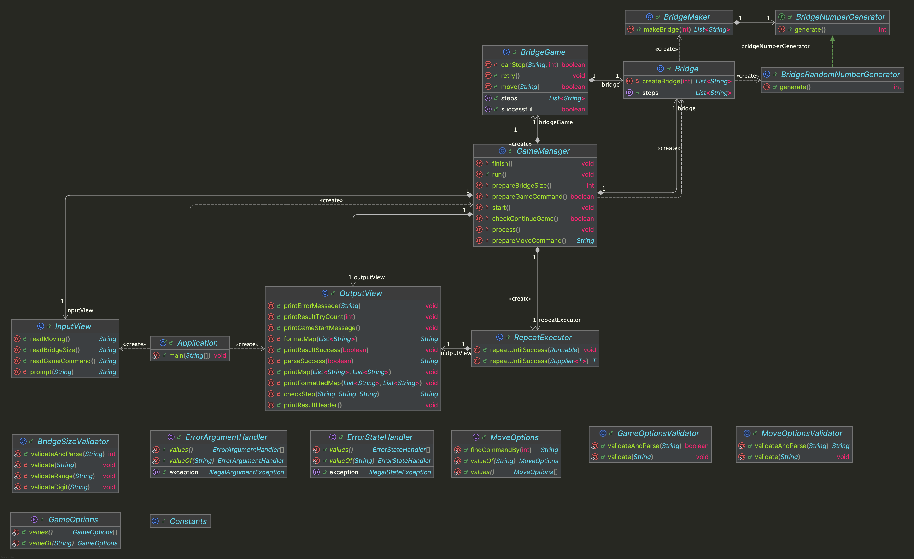

# java-bridge-precourse


---

# 프로젝트 개요

## 프로젝트 구조

```plaintext
└── bridge
    ├── Application.java
    ├── controller
    │ └── GameManager.java
    ├── domain
    │ ├── Bridge.java
    │ ├── BridgeGame.java
    │ ├── BridgeMaker.java
    │ ├── enums
    │ │ ├── GameOptions.java
    │ │ └── MoveOptions.java
    │ └── generator
    │     ├── BridgeNumberGenerator.java
    │     └── BridgeRandomNumberGenerator.java
    ├── handler
    │ ├── ErrorArgumentHandler.java
    │ └── ErrorStateHandler.java
    ├── util
    │ ├── Constants.java
    │ └── RepeatExecutor.java
    ├── validator
    │ ├── BridgeSizeValidator.java
    │ ├── GameOptionsValidator.java
    │ └── MoveOptionsValidator.java
    └── view
        ├── InputView.java
        └── OutputView.java
```


---

## 프로젝트 다이어그램




---

# 구현할 기능 목록

## 🗂️ Domain

### GameOptions
- [ ] 게임을 다시 시도할지 여부에 관한 정보를 저장한다.

### MoveOptions
- [ ] 이동할 칸에 관한 정보를 저장한다.

### BridgeRandomNumberGenerator
- [ ] 무작위로 1 또는 0 숫자를 생성한다.

### Bridge
- [ ] 다리 생성자가 입력받은 길에 해당하는 다리 모양을 생성하도록 한다.

### BridgeGame
- [ ] 사용자가 칸을 이동하도록 한다.
- [ ] 사용자가 게임을 다시 시도하도록 한다.
- [ ] 사용자가 이동할 수 있는 칸인지 확인한다.
- [ ] 사용자가 게임을 성공했는지 여부를 판단한다.

### BridgeMaker
- [ ] 입력받은 길이에 해당하는 다리 모양을 생성한다.


---

## 👀 View

### InputView
- [ ] 입력 기능을 처리한다.
  - [ ] 다리의 길이를 입력 받는다.
  - [ ] 이동할 칸을 입력을 받는다.
  - [ ] 게임을 다시 시도할지 여부를 입력을 받는다.

### OutputView
- [ ] 출력 기능을 처리한다.
  - [ ] 에러 발생시 에러 관련 메시지를 출력한다.
  - [ ] 다리 건너기 게임 시작 메시지를 출력한다.
  - [ ] 현재까지 이동한 다리의 상태를 출력한다.
  - [ ] 게임의 최종 결과를 출력한다.


---

## 🕹️ Controller

### GameManager
- [ ] 다리 건너기 게임 과정을 처리한다.


---

## ✅ Validator

### BridgeSizeValidator
- [ ] 다리 길이의 유효성을 검증한다.
  - [ ] [예외] 다리 길이가 숫자가 아닌 경우, 예외를 발생시킨다.
  - [ ] [예외] 다리 길이가 3 미만, 20 초과인 경우, 예외를 발생시킨다.

### GameOptionsValidator
- [ ] 게임을 다시 시도할지 여부의 유효성을 검증한다.
  - [ ] [예외] `R` 또는 `Q`이 아닌 경우, 예외를 발생시킨다.

### MoveOptionsValidator
- [ ] 이동할 칸 선택의 유효성을 검증한다.
  - [ ] [예외] `U` 또는 `D`이 아닌 경우, 예외를 발생시킨다.


---

## 🛠 Handler

### ErrorArgumentHandler
- [ ] 잘못된 입력인 경우, IllegalArgumentException 예외를 발생시킨다.
  - [ ] 예외 메시지는 `[ERROR]`로 시작한다.

### ErrorStateHandler
- [ ] 잘못된 실행인 경우, IllegalStateException 예외를 발생시킨다.


---

## ⚙️ Util

### Constants
- [ ] 다리 게임 관련 상수를 저장한다.

### RepeatExecutor
- [ ] 실행이 성공할 때까지 재실행을 한다.
  - [ ] IllegalStateException 예외 발생시 재실행을 한다.
  - [ ] IllegalArgumentException 예외 발생시 오류 메시지를 출력하고 재입력을 받는다.
