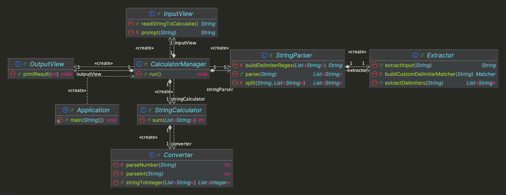

# java-calculator-7


---

# 프로젝트 개요

## 프로젝트 구조

```plaintext
└── calculator
    ├── Application.java
    ├── controller
    │ └── CalculatorManager.java
    ├── domain
    │ ├── Converter.java
    │ ├── Extractor.java
    │ ├── StringCalculator.java
    │ └── StringParser.java
    └── view
        ├── InputView.java
        └── OutputView.java
```


---

## 프로젝트 다이어그램


