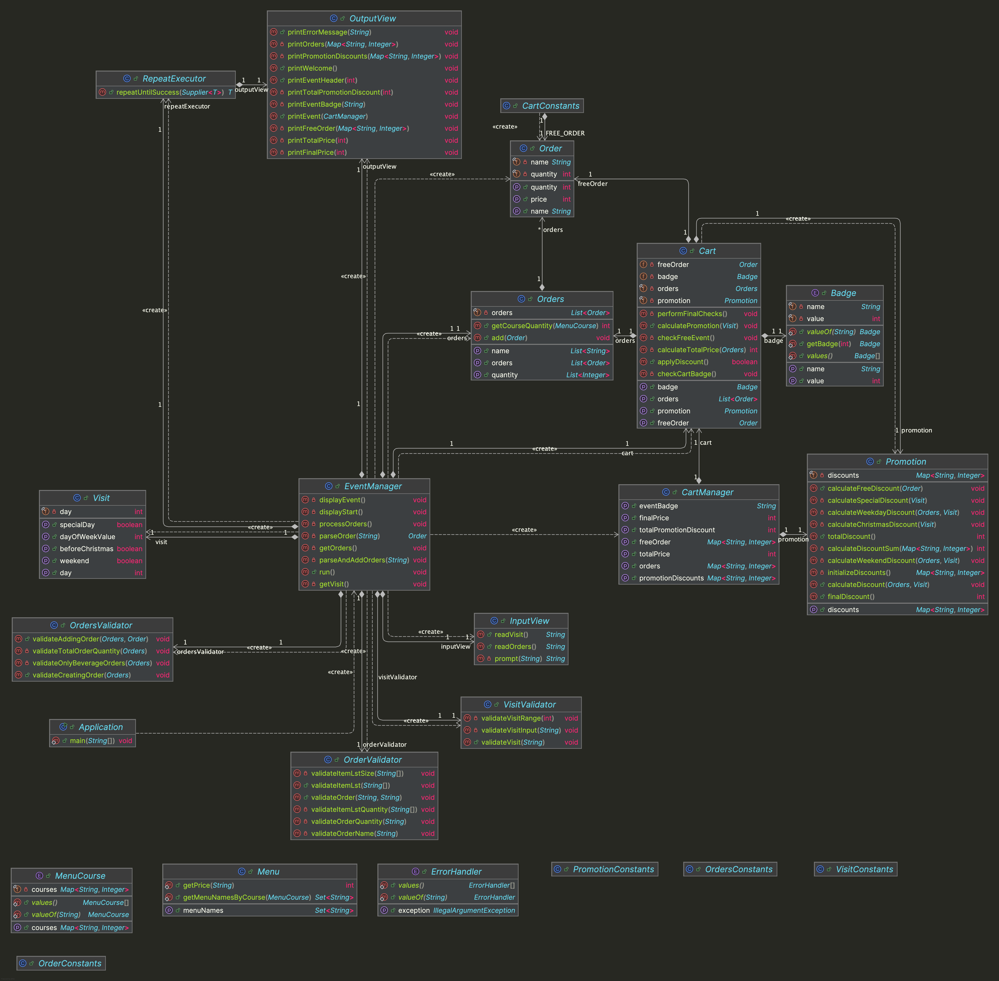

# java-christmas-6


---

# 프로젝트 개요

## 프로젝트 구조

```plaintext
└── christmas
    ├── Application.java
    ├── constants
    │ ├── CartConstants.java
    │ ├── OrderConstants.java
    │ ├── OrdersConstants.java
    │ ├── PromotionConstants.java
    │ └── VisitConstants.java
    ├── controller
    │ ├── CartManager.java
    │ └── EventManager.java
    ├── domain
    │ ├── Badge.java
    │ ├── Cart.java
    │ ├── Menu.java
    │ ├── MenuCourse.java
    │ ├── Order.java
    │ ├── Orders.java
    │ ├── Promotion.java
    │ └── Visit.java
    ├── handler
    │ └── ErrorHandler.java
    ├── util
    │ └── RepeatExecutor.java
    ├── validator
    │ ├── OrderValidator.java
    │ ├── OrdersValidator.java
    │ └── VisitValidator.java
    └── view
        ├── InputView.java
        └── OutputView.java
```


---

## 프로젝트 다이어그램




---

# 구현할 기능 목록

## 🗂️ Domain

### Badge
- [ ] 이벤트 배지의 이름과 최소 금액을 저장한다.
  - [ ] 별, 트리, 산타, 없음 4개의 이벤트 배지를 처리한다.
  - [ ] 금액에 따른 이벤트 배지를 계산한다.

### MenuCourse
- [ ] 코스별 식당 메뉴의 이름과 가격을 저장한다.
  - [ ] 애피타이저, 메인 디쉬, 디저트, 음료 4가지 코스별 식당 메뉴를 처리한다.

### Menu
- [ ] 식당 메뉴들의 이름과 가격을 저장한다.
- [ ] 식당 메뉴들의 이름을 반환한다.
- [ ] 코스별 식당 메뉴들의 이름을 반환한다.
- [ ] 메뉴명에 해당하는 식당 메뉴의 가격을 반환한다.

### Order
- [ ] 주문한 메뉴의 이름과 수량을 저장하고 처리한다.
  - [ ] 주문한 메뉴의 이름을 반환한다.
  - [ ] 주문한 메뉴의 수량을 반환한다.
- [ ] 주문한 메뉴의 총 가격(수량 * 메뉴 가격)을 계산한다.

### Orders
- [ ] 주문한 메뉴들을 저장하고 처리한다.
  - [ ] 주문한 메뉴의 이름을 반환한다.
  - [ ] 주문한 메뉴의 수량을 반환한다.
- [ ] 주문한 메뉴들에 새로 주문한 메뉴를 추가한다.
- [ ] 주문한 메뉴들의 코스별 총 수량을 계산한다.

### Promotion
- [ ] 프로모션 할인 정보를 저장하고 처리한다.
  - [ ] 프로모션 할인 정보를 반환한다.
- [ ] 프로모션 할인 정보를 계산한다.
  - [ ] 크리스마스 이전 프로모션 할인 정보를 계산한다.
  - [ ] 평일 프로모션 할인 정보를 계산한다.
  - [ ] 주말 프로모션 할인 정보를 계산한다.
  - [ ] 특별한 날짜 프로모션 할인 정보를 계산한다.

### Visit
- [ ] 방문하는 날짜에 대한 정보를 저장하고 처리한다.
  - [ ] 방문하는 날짜를 반환한다.
- [ ] 프로모션을 적용할 날짜인지 확인한다.
  - [ ] 크리스마스 이전 날짜인지 확인한다.
  - [ ] 주말인 날짜인지 확인한다.
  - [ ] 특별한 날짜인지 확인한다.
- [ ] 날짜의 현재 요일을 계산한다.

### Cart
- [ ] 카트에 대한 정보를 저장한고 처리한다.
  - [ ] 주문한 메뉴들을 반환한다.
  - [ ] 주문한 메뉴들의 총 가격을 반환한다.
  - [ ] 무료 증정 상품을 반환한다.
  - [ ] 해당하는 프로모션을 반환한다.
  - [ ] 이벤트 배지를 반환한다.
- [ ] 주문한 메뉴들의 총 가격을 계산한다.
- [ ] 프로모션을 적용할 여부를 계산한다.
- [ ] 주문한 메뉴와 방문 날짜에 따른 프로모션 할인을 계산한다.
- [ ] 최종 적용 이벤트를 확인한다.
    - [ ] 무료 증정 상품 추가를 처리한다.
    - [ ] 카트의 이벤트 배지를 처리한다.


---

## 👀 View

### InputView
- [ ] 입력 기능을 처리한다.
  - [ ] 12월 중 식당 예상 방문 날짜를 입력받는다.
  - [ ] 주문하실 메뉴를 메뉴와 개수를 입력받는다.

### OutputView
- [ ] 출력 기능을 처리한다.
  - [ ] 에러 발생시 에러 관련 메시지를 출력한다.
  - [ ] 주문 메뉴를 출력한다.
  - [ ] 할인 전 총주문 금액를 출력한다.
  - [ ] 증정 메뉴를 출력한다.
  - [ ] 혜택 내역를 출력한다.
  - [ ] 총혜택 금액를 출력한다.
  - [ ] 할인 후 예상 결제 금액를 출력한다.
  - [ ] 12월 이벤트 배지를 출력한다.


---

## 🕹️ Controller

### CartManager
- [ ] 카트의 메뉴명과 수량을 반환한다.
- [ ] 카트의 총 가격을 계산한다.
- [ ] 카트의 무료 상품에 대한 정보(상품명, 수량)를 반환한다.
- [ ] 카트의 프로모션 할인 정보를 반환한다.
- [ ] 카트의 프로모션 총 할인 금액을 계산한다.
- [ ] 카트의 총 가격으로부터 총 할인 금액을 뺀 최종 결제 금액을 계산해 반환한다.
- [ ] 카트의 이벤트 배지를 반환한다.

### EventManager
- [ ] 식당 환영 메시지를 출력한다.
- [ ] 방문할 날짜를 입력받는다.
- [ ] 주문할 메뉴를 입력받는다.
- [ ] 방문할 날짜와 주문할 메뉴에 따른 적용 프로모션을 처리한다.
- [ ] 최종 이벤트 정보를 출력한다.


---

## ✅ Validator

### OrderValidator
- [ ] 주문 항목의 유효성을 검증한다.
    - [ ] [예외] 주문 항목의 크기가 2가 아닌 경우, 예외를 발생시킨다.
    - [ ] [예외] 주문 항목의 수량이 숫자가 아닌 경우, 예외를 발생시킨다.
- [ ] 주문의 유효성을 검증한다.
  - [ ] [예외] 식당 메뉴에 주문 메뉴명이 없는 경우, 예외를 발생시킨다.
  - [ ] [예외] 주문 메뉴 수량이 양수가 아닌 경우, 예외를 발생시킨다.

### OrdersValidator
- [ ] 추가하는 주문의 유효성을 검증한다.
  - [ ] [예외] 이미 주문한 메뉴를 재주문하는 경우, 예외를 발생시킨다.
- [ ] 생성하는 주문의 유효성을 검증한다.
  - [ ] [예외] 음료만 주문하는 경우, 예외를 발생시킨다.
  - [ ] [예외] 주문한 메뉴의 총 수량이 20개를 초과하는 경우, 예외를 발생시킨다.

### VisitValidator
- [ ] 방문의 유효성을 검증한다.
  - [예외] 방문 날짜가 숫자가 아닌 경우, 예외를 발생시킨다.
  - [예외] 방문 날짜가 1 미만이거나 31을 초과하는 경우, 예외를 발생시킨다.


---

## 🛠 Handler

### ErrorHandler
- [ ] 잘못된 입력 시 오류 메시지를 출력하고 재입력을 유도한다.
  - [ ] 잘못된 입력 시 IllegalArgumentException 예외를 발생시킨다.


---

## ⚙️ Util

### RepeatExecutor
- [ ] 입력이 성공할 때까지 재입력을 받는다.
  - [ ] IllegalArgumentException 예외 발생시 재입력을 받는다.


---

## 💬 Constants

### CartConsants
- [ ] Cart 관련 상수를 저장한다.

### OrderConsants
- [ ] Order 관련 상수를 저장한다.

### OrdersConsants
- [ ] Orders 관련 상수를 저장한다.

### PromotionConsants
- [ ] Promotion 관련 상수를 저장한다.

### VisitConsants
- [ ] Visit 관련 상수를 저장한다.
