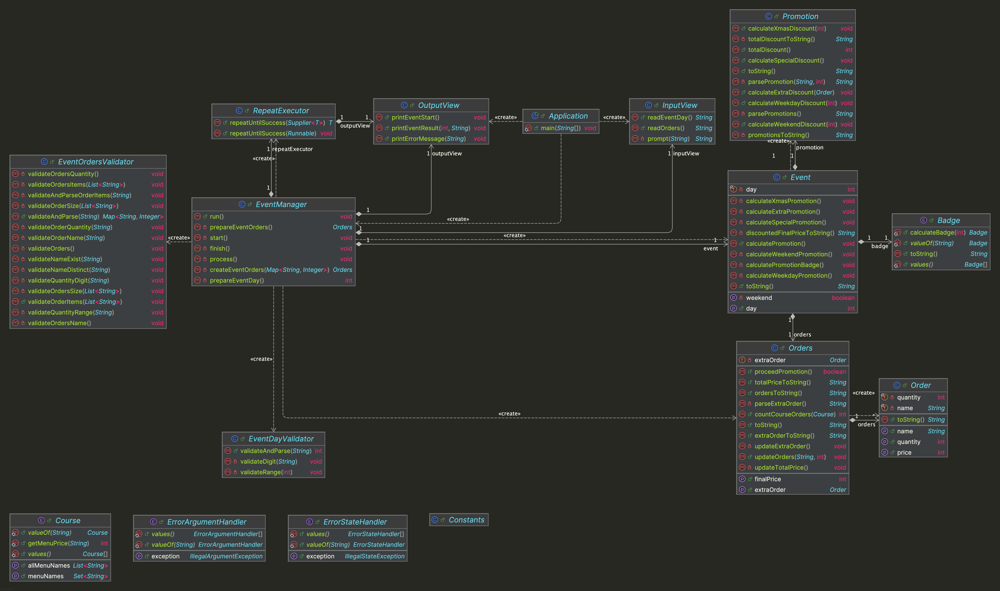

# java-christmas-6


---

# 프로젝트 개요

## 프로젝트 구조

```plaintext
└── christmas
    ├── Application.java
    ├── controller
    │ └── EventManager.java
    ├── domain
    │ ├── Event.java
    │ ├── Order.java
    │ ├── Orders.java
    │ ├── Promotion.java
    │ └── enums
    │     ├── Badge.java
    │     └── Course.java
    ├── handler
    │ ├── ErrorArgumentHandler.java
    │ └── ErrorStateHandler.java
    ├── util
    │ ├── Constants.java
    │ └── RepeatExecutor.java
    ├── validator
    │ ├── EventDayValidator.java
    │ └── EventOrdersValidator.java
    └── view
        ├── InputView.java
        └── OutputView.java
```


---

## 프로젝트 다이어그램


