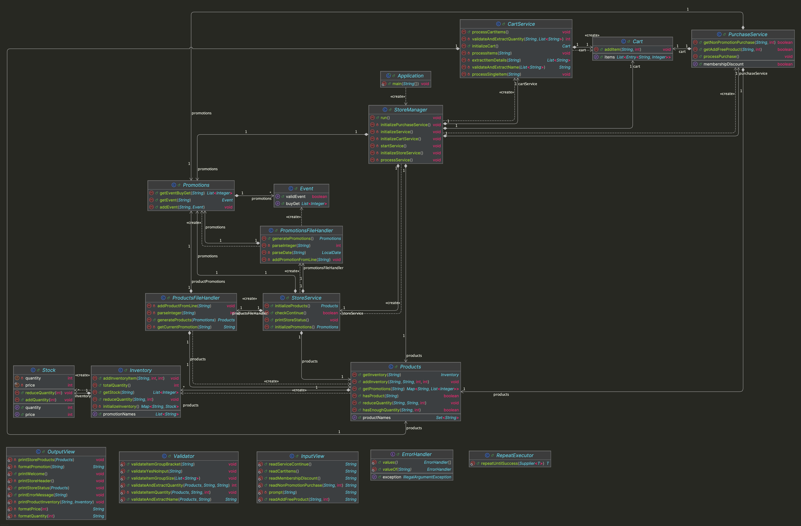

# java-convenience-store-precourse


---

# 프로젝트 개요

## 프로젝트 구조

```plaintext
├── java
│ └── store
│     ├── Application.java
│     ├── controller
│     │ └── StoreManager.java
│     ├── domain
│     │ ├── Cart.java
│     │ ├── Event.java
│     │ ├── Inventory.java
│     │ ├── Products.java
│     │ ├── Promotions.java
│     │ └── Stock.java
│     ├── handler
│     │ ├── ErrorHandler.java
│     │ ├── ProductsFileHandler.java
│     │ └── PromotionsFileHandler.java
│     ├── service
│     │ ├── CartService.java
│     │ ├── PurchaseService.java
│     │ └── StoreService.java
│     ├── util
│     │ ├── RepeatExecutor.java
│     │ └── Validator.java
│     └── view
│         ├── InputView.java
│         └── OutputView.java
└── resources
    ├── products.md
    └── promotions.md
```


---

## 프로젝트 다이어그램




---

# 구현할 기능 목록

## 🗂️ Domain

### Cart
- [ ] 구매할 상품명, 구매할 상품 수량 관련 데이터를 처리한다.

### Stock
- [ ] 상품의 가격, 상품의 현재 수량 관련 데이터를 처리한다.
  - [ ] 상품 수량을 증가시킨다.
  - [ ] 상품 수량을 감소시킨다.

### Inventory
- [ ] 프로모션명, 프로모션 Stock(가격, 수량) 관련 데이터를 처리한다.
  - [ ] 상품의 총 재고 수량을 계산한다.
  - [ ] 프로모션이 있는 경우, 프로모션 없는 경우보다 먼저 오도록 정렬한다. 
  - [ ] 프로모션 상품 수량을 감소시킨다.

### Products
- [ ] 상품명, 상품 Inventory(프로모션명, 프로모션 Stock(가격, 수량)) 관련 데이터를 처리한다.
  - [ ] 편의점 재고에 상품이 존재하는지 확인한다.
  - [ ] 편의점 재고에 상품 수량이 충분한지 확인한다.
  - [ ] 편의점 재고의 프로모션 상품 수량을 감소시킨다.

### Event
- [ ] 이벤트의 구매 수량, 증정 수량 관련 데이터를 처리한다.
- [ ] 현재 유효한 프로모션인지 확인한다.

### Promotions
- [ ] 프로모션명, 이벤트(구매 수량, 증정 수량) 관련 데이터를 처리한다.
- [ ] 유효한 프로모션인 경우 이벤트를 추가한다.


---

## 👀 View

### InputView
- [ ] 입력 기능을 처리한다.
  - [ ] 구매할 상품명과 수량을 입력받는다.
  - [ ] 프로모션을 적용하지 않은 결제 진행 여부를 입력받는다.
  - [ ] 무료 증정 상품 추가 여부를 입력받는다.
  - [ ] 멤버십 할인 적용 여부를 입력받는다.
  - [ ] 계속 상품 구매를 진행할 여부를 입력받는다.

### OutputView
- [ ] 출력 기능을 처리한다.
  - [ ] 편의점 서비스 시작 환영 메시지를 출력한다.
  - [ ] 현재 편의점 재고 상태를 출력한다.
  - [ ] 구매 영수증을 출력한다.


---

## 🕹️ Controller

### StoreManager
- [ ] 구매할 상품 입력, 처리, 결제 과정을 관리한다.
  - [ ] 가게 서비스, 카트 서비스, 구매 서비스를 초기화한다.
  - [ ] 편의점 서비스를 시작한다.
  - [ ] 편의점 서비스의 상품 구매 프로세스를 처리한다.
  - [ ] 편의점 서비스를 종료한다.


---

## 🎛️ Service

### CartService
- [ ] 구매할 상품의 값들을 추출해 Cart에 담는다.

### PurchaseService
- [ ] 구매할 상품의 구매 과정을 관리한다.
  - [ ] 프로모션을 적용하지 않고 상품을 구매할 여부를 처리한다.
  - [ ] 프로모션 상품의 무료 수량을 추가할 여부를 처리한다.
  - [ ] 멤버십 할인 적용하는 여부를 처리한다.

### StoreService
- [ ] 가게 서비스를 사용하기 위한 과정을 관리한다.
  - [ ] products 정보를 불러온다.
  - [ ] promotions 정보를 불러온다.
  - [ ] 현재 상품 재고를 출력한다.
  - [ ] 계속 상품 구매를 진행할 여부를 처리한다.

---

## 🛠 Handler

### ErrorHandler
- [ ] 잘못된 입력 시 오류 메시지를 출력하고 재입력을 유도한다.
  - [ ] 잘못된 입력 시 IllegalArgumentException 예외를 발생시킨다.

### ProductsFileHandler
- [ ] products.md 파일 정보를 불러온다.

### PromotionsFileHandler
- [ ] promotions.md 파일 정보를 불러온다.


---

## ⚙️ Util

### RepeatExecutor
- [ ] 입력이 성공할 때까지 재입력을 받는다.
  - [ ] IllegalArgumentException 예외 발생시 재입력을 받는다.

### Validator
- [ ] 입력값의 유효성을 검증한다.
  - 상품 그룹이 `[`로 시작하고 `]`로 끝나는지 유효성을 검증한다.
  - 상품 그룹의 크기가 2인지 유효성을 검증한다.
  - 입력값이 `Y` 또는 `N`인지 유효성을 검증한다.
- [ ] 입력한 상품의 유효성을 검증하고 데이터를 추출한다.
  - [ ] 상품 이름이 존재하는지 유효성을 검증한다.
  - [ ] 상품 수량의 유효성을 검증한다.
    - [ ] 상품 수량이 숫자인지 유효성을 검증한다.
    - [ ] 상품 수량이 충분한지 유효성을 검증한다.
