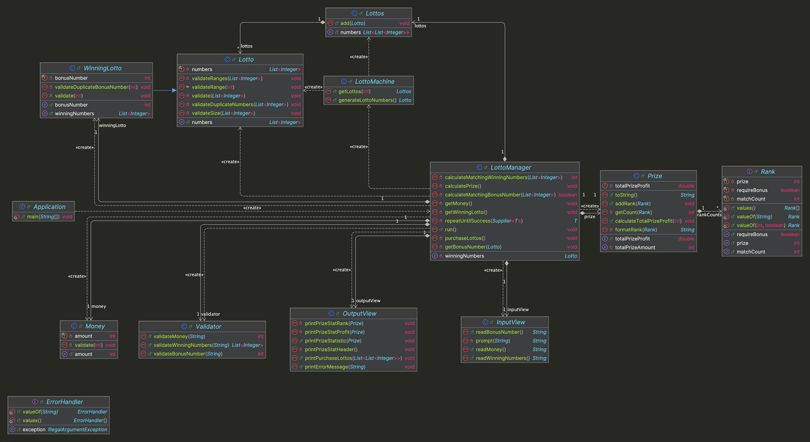

# java-lotto-precourse


---

# 프로젝트 개요

## 프로젝트 구조

```plaintext
└── lotto
    ├── Application.java
    ├── controller
    │ └── LottoManager.java
    ├── domain
    │ ├── Lotto.java
    │ ├── LottoMachine.java
    │ ├── Lottos.java
    │ ├── Money.java
    │ ├── Prize.java
    │ └── WinningLotto.java
    ├── handler
    │ ├── ErrorHandler.java
    │ ├── Rank.java
    │ └── Validator.java
    └── view
        ├── InputView.java
        └── OutputView.java
```


---

## 프로젝트 다이어그램




---

# 구현할 기능 목록

## 🗂️ Domain

### Lotto
- [ ] 로또 번호 6개를 저장하고 처리한다.
- [ ] 로또 번호 6개의 유효성을 검증한다.
  - [ ] [예외] 번호가 6개 아닌 경우, IllegalArgumentException 예외를 발생시킨다.
  - [ ] [예외] 중복된 번호가 있는 경우, IllegalArgumentException 예외를 발생시킨다.
  - [ ] [예외] 번호가 1-45의 범위가 아닌 경우, IllegalArgumentException 예외를 발생시킨다.

### Lottos
- [ ] 로또 티켓 묶음에 구매한 로또 티켓을 추가한다.
- [ ] 구매한 로또 티켓들의 번호들을 반환한다.

### LottoMachine
- [ ] 로또 티켓을 생성한다.
  - [ ] 구입 금액만큼 1000원 당 로또 티켓 1장을 생성한다.
  - [ ] 1-45 범위의 숫자 6개를 랜덤으로 추출해 로또 티켓을 생성한다.

### Money
- [ ] 구입 금액을 저장하고 처리한다.
- [ ] 구입 금액의 유효성을 검증한다.
  - [ ] [예외] 금액이 양수가 아닌 경우, IllegalArgumentException 예외를 발생시킨다.
  - [ ] [예외] 금액이 로또 티켓 1장 가격(1000원)으로 나누어 떨어지지 않는 경우, IllegalArgumentException 예외를 발생시킨다.

### Prize
- [ ] 구입한 로또 티켓의 당첨 결과를 처리한다.
  - [ ] 로또 티켓의 당첨 순위별 개수를 계산한다.
  - [ ] 당첨 결과의 상금의 합계를 계산한다.
  - [ ] 당첨 결과의 총 수익률을 계산한다.
    - [ ] 상금 합계 / 구입 금액 * 100으로 수익률을 계산한다.

### WinningLotto
- [ ] 당첨 로또의 번호 6개와 보너스 번호를 저장하고 처리한다.
- [ ] 보너스 번호의 유효성을 검증한다.
  - [ ] [예외] 보너스 번호가 1-45의 범위가 아닌 경우, IllegalArgumentException 예외를 발생시킨다.
  - [ ] [예외] 보너스 번호가 당첨 번호 6개와 중복되는 경우, IllegalArgumentException 예외를 발생시킨다.


---

## 👀 View

### InputView
- [ ] 입력 기능을 처리한다.
  - [ ] 구입 금액을 입력받는다.
  - [ ] 당첨 번호를 입력받는다.
  - [ ] 보너스 번호를 입력받는다.

### OutputView
- [ ] 출력 기능을 처리한다.
  - [ ] 에러 발생시 에러 관련 메시지를 출력한다.
  - [ ] 구매한 로또 티켓을 출력한다.
    - [ ] 구매한 로또 티켓의 수를 출력한다.
    - [ ] 구매한 로또 티켓의 번호를 출력한다.
  - [ ] 로또 당첨 통계를 출력한다.
  - [ ] 로또 당첨 수익률을 출력한다.


---

## 🕹️ Controller

### LottoManger
- [ ] 로또 구입 금액을 입력 받는다.
- [ ] 로또 구입 금액으로 로또 티켓을 구매한다.
- [ ] 당첨 로또의 번호와 보너스 번호를 입력 받는다.
- [ ] 구입한 로또 티켓의 당첨 결과를 계산한다.
- [ ] 당첨 결과의 통계와 수익률을 출력한다.


---

## 🛠 Handler

### ErrorHandler
- [ ] 잘못된 입력 시 오류 메시지를 출력하고 재입력을 유도한다.
  - [ ] 잘못된 입력 시 IllegalArgumentException 예외를 발생시킨다.

### Rank
- [ ] 로또 티켓의 당첨 순위에 대한 정보를 저장하고 처리한다.
  - [ ] 일치하는 당첨 번호 개수를 저장하고 처리한다.
  - [ ] 보너스 번호 일치 필요 여부를 저장하고 처리한다.
  - [ ] 당첨 상금 금액을 저장한고 처리한다.

### Validator
- [ ] 입력값의 유효성을 검증한다.
  - [ ] 로또 구매 금액의 유효성을 검증한다.
  - [ ] 로또 당첨 번호의 유효성을 검증한다.
  - [ ] 로또 보너스 번호의 유효성을 검증한다.
