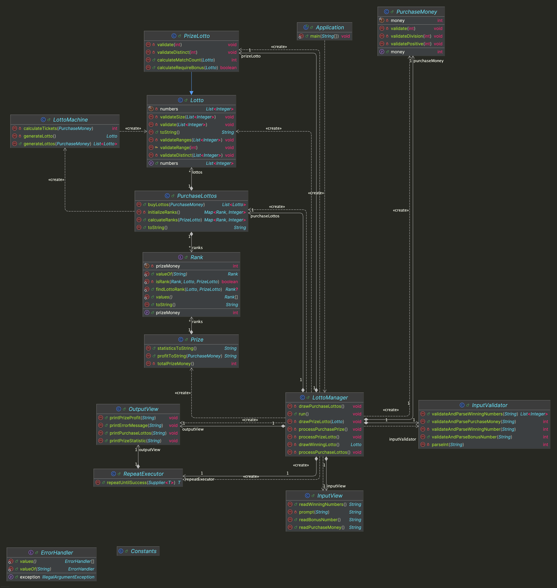

# java-lotto-precourse


---

# 프로젝트 개요

## 프로젝트 구조

```plaintext
└── lotto
    ├── Application.java
    ├── controller
    │ └── LottoManager.java
    ├── domain
    │ ├── Lotto.java
    │ ├── LottoMachine.java
    │ ├── Prize.javaf
    │ ├── PrizeLotto.java
    │ ├── PurchaseLottos.java
    │ ├── PurchaseMoney.java
    │ └── Rank.java
    ├── handler
    │ └── ErrorHandler.java
    ├── util
    │ ├── Constants.java
    │ └── RepeatExecutor.java
    ├── validator
    │ └── InputValidator.java
    └── view
        ├── InputView.java
        └── OutputView.java
```


---

## 프로젝트 다이어그램


