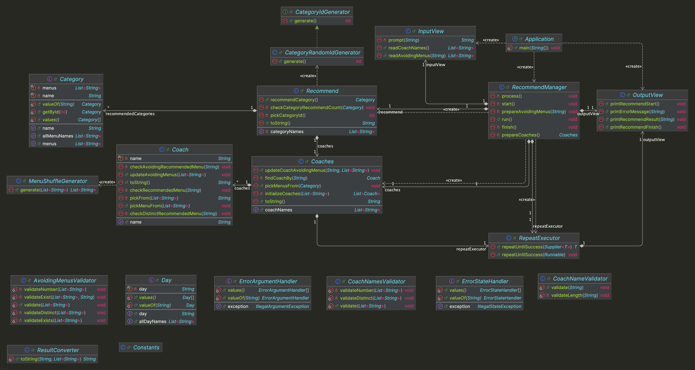

# java-menu-precourse


---

# 프로젝트 개요

## 프로젝트 구조

```plaintext
└── menu
    ├── Application.java
    ├── controller
    │ └── RecommendManager.java
    ├── domain
    │ ├── Coach.java
    │ ├── Coaches.java
    │ ├── Recommend.java
    │ ├── enums
    │ │ ├── Category.java
    │ │ └── Day.java
    │ └── generator
    │     ├── CategoryIdGenerator.java
    │     ├── CategoryRandomIdGenerator.java
    │     └── MenuShuffleGenerator.java
    ├── handler
    │ ├── ErrorArgumentHandler.java
    │ └── ErrorStateHandler.java
    ├── util
    │ ├── Constants.java
    │ ├── RepeatExecutor.java
    │ └── ResultConverter.java
    ├── validator
    │ ├── AvoidingMenusValidator.java
    │ ├── CoachNameValidator.java
    │ └── CoachNamesValidator.java
    └── view
        ├── InputView.java
        └── OutputView.java
```


---

## 프로젝트 다이어그램




---

# 구현할 기능 목록

## 🗂️ Domain

### Category
- [ ] 일식, 한식, 중식, 아시안, 양식 카테고리와 해당 카테고리의 메뉴 데이터를 처리한다.
  - [ ] 모든 카테고리의 모든 메뉴의 이름을 반환한다.

### Day
- [ ] 월요일, 화요일, 수요일, 목요일, 금요일 데이터를 처리한다.
  - [ ] 모든 요일의 이름을 반환한다.

### CategoryRandomIdGenerator
- [ ] 무작위로 1 이상 5 이하의 카테고리 ID를 생성한다.

### MenuShuffleGenerator
- [ ] 무작위로 메뉴 리스트를 섞는다.

### Coach
- [ ] 코치의 못 먹는 메뉴를 업데이트한다.
- [ ] 코치에게 메뉴를 추천한다.
  - [ ] [예외] 못 먹는 메뉴에 해당하는 메뉴를 추천 받은 경우, 예외를 발생시킨다.
  - [ ] [예외] 이미 추천받은 메뉴에 해당하는 메뉴를 추천 받은 경우, 예외를 발생시킨다.
- [ ] 코치가 추천 받은 메뉴 결과를 반환한다.

### Coaches
- [ ] 코치들의 못 먹는 메뉴를 업데이트한다.
- [ ] 추천 받은 카테고리에 해당하는 메뉴들을 코치에게 추천한다.
- [ ] 코치 이름으로 코치를 찾는다.
- [ ] 코치들이 추천 받은 결과를 반환한다.

### Recommend
- [ ] 카테고리를 추천한다.
- [ ] 지금까지 추천한 카테고리 빈도를 확인한다.
- [ ] 무작위로 카테고리 ID를 생성한다.


---

## 👀 View

### InputView
- [ ] 입력 기능을 처리한다.
  - [ ] 코치 이름들을 입력을 받는다.
  - [ ] 코치가 못 먹는 메뉴를 입력을 받는다.

### OutputView
- [ ] 출력 기능을 처리한다.
  - [ ] 에러 발생시 에러 관련 메시지를 출력한다.
  - [ ] 점심 메뉴 추천 시작 메시지를 출력한다.
  - [ ] 점심 메뉴 추천 결과를 출력한다.
  - [ ] 점심 메뉴 추천 완료 메시지를 출력한다.


---

## 🕹️ Controller

### RecommendManager
- [ ] 메뉴 추천 과정을 처리한다.
  - [ ] 메뉴를 추천받을 코치들을 등록하도록 한다.
  - [ ] 코치들에게 메뉴를 추천하도록 한다.
  - [ ] 추천한 결과를 보여주도록 한다.


---

## ✅ Validator

### AvoidingMenusValidator
- [ ] 못 먹는 메뉴들의 유효성을 검증한다.
  - [ ] [예외] 못 먹는 메뉴가 0개 미만, 2개 초과인 경우, 예외를 발생시킨다.
  - [ ] [예외] 못 먹는 메뉴가 중복되는 메뉴인 경우, 예외를 발생시킨다.
  - [ ] [예외] 못 먹는 메뉴가 존재하지 않는 경우, 예외를 발생시킨다.

### CoachNamesValidator
- [ ] 코치 이름들의 유효성을 검증한다.
  - [ ] [예외] 코치 이름이 2명 미만, 5명 초과인 경우, 예외를 발생시킨다.
  - [ ] [예외] 코치 이름이 중복되는 경우, 예외를 발생시킨다.

### CoachNameValidator
- [ ] 코치 이름의 유효성을 검증한다.
  - [ ] [예외] 코치 이름이 2글자 미만, 4글자 초과인 경우, 예외를 발생시킨다.


---

## 🛠 Handler

### ErrorArgumentHandler
- [ ] 잘못된 입력인 경우, `IllegalArgumentException` 예외를 발생시킨다.
  - [ ] 예외 메시지는 `[ERROR]`로 시작한다.

### ErrorStateHandler
- [ ] 잘못된 실행인 경우, `IllegalStateException` 예외를 발생시킨다.


---

## ⚙️ Util

### Constants
- [ ] 메뉴 추천 관련 상수를 저장한다.

### RepeatExecutor
- [ ] 실행이 성공할 때까지 재실행을 한다.
  - [ ] `IllegalStateException` 예외가 발생하는 경우, 재실행을 한다.
  - [ ] `IllegalArgumentException` 예외가 발생하는 경우, 오류 메시지를 출력하고 재입력을 받는다.

### ResultConverter
- [ ] 출력할 결과 형식으로 데이터를 변환시킨다.
