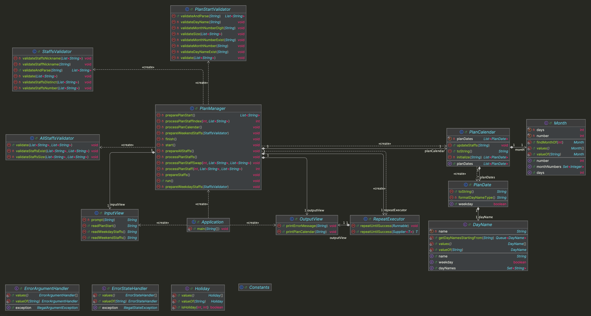

# java-oncall-6


---

# 프로젝트 개요

## 프로젝트 구조

```plaintext
└── oncall
    ├── Application.java
    ├── controller
    │ └── PlanManager.java
    ├── domain
    │ ├── PlanCalendar.java
    │ ├── PlanDate.java
    │ └── enums
    │     ├── DayName.java
    │     ├── Holiday.java
    │     └── Month.java
    ├── handler
    │ ├── ErrorArgumentHandler.java
    │ └── ErrorStateHandler.java
    ├── util
    │ ├── Constants.java
    │ └── RepeatExecutor.java
    ├── validator
    │ ├── AllStaffsValidator.java
    │ ├── PlanStartValidator.java
    │ └── StaffsValidator.java
    └── view
        ├── InputView.java
        └── OutputView.java
```


---

## 프로젝트 다이어그램




---

# 구현할 기능 목록

## 🗂️ Domain

### DayName
- [ ] 요일 관련 정보를 처리한다.
  - [ ] 모든 요일의 이름을 구한다.
  - [ ] 배정 받은 월이 시작하는 요일에 해당하는 요일 순서를 정렬한다.
  - [ ] 평일 여부를 판단한다.

### Holiday
- [ ] 공휴일 관련 정보를 처리한다.
  - [ ] 공휴일 여부를 판단한다.

### Month
- [ ] 월 관련 정보를 처리한다.
  - [ ] 월의 숫자와 날짜 수를 저장한다.
    - [ ] 2월 같은 경우 28일로 날짜 수를 저장한다.
  - [ ] 모든 월의 숫자를 구한다.
  - [ ] 월의 숫자에 해당하는 월을 구한다.

### PlanCalendar
- [ ] 비상근무 계획 관련 정보를 처리한다.
  - [ ] 배정할 월과 시작하는 요일에 해당하는 1달 달력(날짜와 요일)을 생성한다.
  - [ ] 비상근무할 사원을 배정한다.

### PlanDate
- [ ] 근무 날짜 관련 정보를 처리한다.
  - [ ] 날짜 숫자, 요일, 공휴일 여부를 저장한다.
  - [ ] 평일인지(주말 또는 공휴일이 아닌지) 판단한다.


---

## 👀 View

### InputView
- [ ] 입력 기능을 처리한다.
  - [ ] 비상 근무를 배정할 월과 시작 요일을 입력 받는다.
  - [ ] 평일 비상 근무 순번대로 사원 닉네임을 입력 받는다.
  - [ ] 주말 비상 근무 순번대로 사원 닉네임을 입력 받는다.

### OutputView
- [ ] 출력 기능을 처리한다.
  - [ ] 에러 발생시 에러 관련 메시지를 출력한다.
  - [ ] 비상근무 계획 결과를 출력한다.


---

## 🕹️ Controller

### PlanManager
- [ ] 비상근무 계획 과정을 처리한다.
  - [ ] 비상근무 계획 관련 정보를 입력받도록 한다.
    - [ ] 비상근무 배정 월과 시작 요일을 입력받도록 한다.
    - [ ] 비상근무 배정 월과 시작 요일에 해당하는 비상근무 달력을 생성한다.
    - [ ] 평일 근무 사원 순서와 주말 근무 사원 순서를 입력받도록 한다.
  - [ ] 비상근무를 할 사원들의 순번을 편성한다.
    - [ ] 같은 사원이 2일 연속 근무하는 경우, 다음 근무자와 순서를 바꿔 편성한다.
  - [ ] 비상근무 계획 결과를 출력하도록 한다.


---

## ✅ Validator

### AllStaffsValidator
- [ ] 평일 근무 사원과 주말 근무 사원의 유효성을 검증한다.
  - [ ] [예외] 평일 근무 사원의 수와 주말 근무 사원의 수가 다른 경우, 예외를 발생시킨다.
  - [ ] [예외] 근무 사원이 평일과 주말에 1회씩 근무하지 않는 경우, 예외를 발생시킨다.

### StaffsValidator
- [ ] 입력받는 근무 사원의 순번을 리스트로 추출한다.
- [ ] 근무 사원의 유효성을 검증한다.
  - [ ] [예외] 근무 사원의 수가 5명 미만, 35명 초과인 경우, 예외를 발생시킨다.
  - [ ] [예외] 근무 사원의 닉네임이 중복되는 경우, 예외를 발생시킨다.
  - [ ] [예외] 근무 사원의 닉네임이 1자 미만, 5자 초과인 경우, 예외를 발생시킨다.

### PlanStartValidator
- [ ] 배정할 월과 시작 요일을 리스트로 추출한다.
- [ ] 배정할 월과 시작 요일의 유효성을 검증한다.
  - [ ] [예외] 추출한 리스트의 크기 2가 아닌 경우, 예외를 발생시킨다.
  - [ ] 배정할 월의 유효성을 검증한다.
    - [ ] [예외] 배정할 월이 숫자가 아닌 경우, 예외를 발생시킨다.
    - [ ] [예외] 배정할 월이 존재하는 월이 아닌 경우, 예외를 발생시킨다.
  - [ ] 배정할 월의 시작 요일의 유효성을 검증한다.
    - [ ] [예외] 배정할 월의 요일이 존재하는 요일이 아닌 경우, 예외를 발생시킨다.

---

## 🛠 Handler

### ErrorArgumentHandler
- [ ] 잘못된 입력인 경우, `IllegalArgumentException` 예외를 발생시킨다.
  - [ ] 예외 메시지는 `[ERROR]`로 시작한다.

### ErrorStateHandler
- [ ] 잘못된 실행인 경우, `IllegalStateException` 예외를 발생시킨다.
  - [ ] 예외 메시지는 `[ERROR]`로 시작한다.


---

## ⚙️ Util

### Constants
- [ ] 비상근무 계획 관련 상수를 저장한다.

### RepeatExecutor
- [ ] 실행이 성공할 때까지 재실행을 한다.
  - [ ] `IllegalStateException` 예외가 발생하는 경우, 재실행을 한다.
  - [ ] `IllegalArgumentException` 예외가 발생하는 경우, 오류 메시지를 출력하고 재입력을 받는다.
