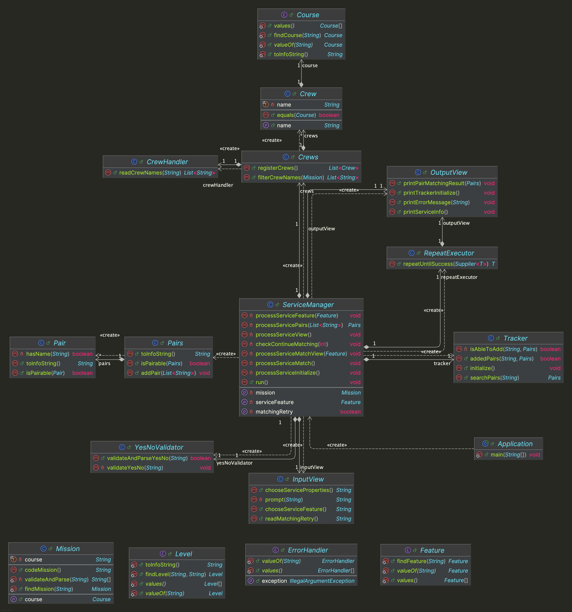

# java-pairmatching-precourse


---

# 프로젝트 개요

## 프로젝트 구조

```plaintext
└── pairmatching
    ├── Application.java
    ├── controller
    │ └── ServiceManager.java
    ├── domain
    │ ├── Crew.java
    │ ├── Crews.java
    │ ├── Feature.java
    │ ├── Pair.java
    │ ├── Pairs.java
    │ ├── Tracker.java
    │ └── mission
    │     ├── Course.java
    │     ├── Level.java
    │     └── Mission.java
    ├── handler
    │ ├── CrewHandler.java
    │ └── ErrorHandler.java
    ├── util
    │ └── RepeatExecutor.java
    ├── validator
    │ └── YesNoValidator.java
    └── view
        ├── InputView.java
        └── OutputView.java
```


---

## 프로젝트 다이어그램




---

# 구현할 기능 목록

## 🗂️ Domain

### Course
- [ ] 코스 분야(백엔드, 프론트엔드)에 관한 정보를 처리한다.

### Level
- [ ] 레벨과 레벨별 미션에 관한 정보를 처리한다.

### Mission
- [ ] 페어매칭할 미션인 코스와 레벨의 조합을 처리한다.
  - [ ] 입력한 미션에 대한 정보에 해당하는 미션을 찾는다.
  - [ ] 입력한 미션에 대한 정보의 유효성을 검증하고 파싱한다.
    - [ ] [예외] 입력한 미션에 대한 정보가 3개가 아닌 경우, 예외를 발생시킨다.

### Crew
- [ ] 크루원에 대한 정보를 처리한다.
  - [ ] 크루원의 코스 분야와 이름을 저장한다.
  - [ ] 크루원이 특정 코스 분야에 해당하는지 판단한다.

### Crews
- [ ] 크루원들에 대한 정보를 처리한다.
  - [ ] 크루원들에 대한 정보를 등록한다.
  - [ ] 코스 분야에 따른 크루원들의 이름을 추출한다.

### Feature
- [ ] 페어 매칭 기능에 관한 정보를 처리한다.

### Pair
- [ ] 크루원의 페어에 대한 정보를 처리한다.
  - [ ] 페어에 크루원이 존재하는지 판단한다.
  - [ ] 페어할 수 있는 여부를 판단한다.

### Pairs
- [ ] 크루원들의 페어에 대한 정보를 처리한다.
  - [ ] 크루원의 페어를 추가한다.
  - [ ] 크루원들을 페어할 수 있는 여부를 판단한다.

### Tracker
- [ ] 페어 매칭 기록을 처리한다.
  - [ ] 페어 매칭 기록을 초기화한다.
  - [ ] 미션에 해당하는 페어 매칭 기록을 찾는다.
  - [ ] 미션에 해당하는 페어 매칭 기록 추가 여부를 판단한다.
  - [ ] 미션에 해당하는 페어 매칭 기록을 추가한다.


---

## 👀 View

### InputView
- [ ] 입력 기능을 처리한다.
  - [ ] 페어 매칭 기능 선택을 입력받는다.
  - [ ] 과정, 레벨, 미션을 입력받는다.
  - [ ] 다시 매칭 여부를 입력받는다.

### OutputView
- [ ] 출력 기능을 처리한다.
  - [ ] 에러 발생시 에러 관련 메시지를 출력한다.
  - [ ] 페어 매칭이 가능한 과정과 미션을 출력한다.
  - [ ] 페어 매칭 결과를 출력한다.
  - [ ] 페어 매칭 기록 초기화 메시지를 출력한다.


---

## 🕹️ Controller

### ServiceManager
- [ ] 페어매칭 과정을 처리한다.


---

## ✅ Validator

### YesNoValidator
- [ ] '예' 또는 '아니오' 응답의 유효성을 검증한다.
  - [ ] [예외] `Y` 또는 `N`이 아닌 경우, 예외를 발생시킨다.


---

## 🛠 Handler

### ErrorHandler
- [ ] 잘못된 입력 시 오류 메시지를 출력하고 재입력을 유도한다.
  - [ ] 잘못된 입력 시 IllegalArgumentException 예외를 발생시킨다.
  - [ ] 오류 메시지는 `[ERROR]`로 시작하도록 한다.

### CrewHandler
- [ ] `frontend-crew.md` 또는 `backend-crew.md`의 크루 정보를 불러오고 파싱한다.


---

## ⚙️ Util

### RepeatExecutor
- [ ] 입력이 성공할 때까지 재입력을 받는다.
  - [ ] IllegalArgumentException 예외 발생시 재입력을 받는다.
