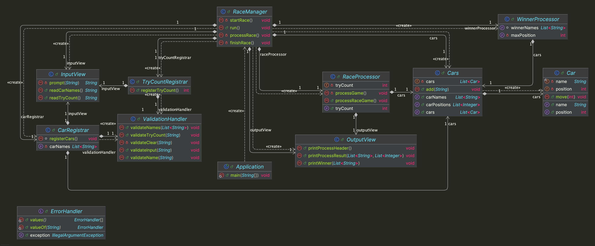

# java-racingcar-7


---

# 프로젝트 개요

## 프로젝트 구조

```plaintext
└── racingcar
    ├── Application.java
    ├── controller
    │ ├── CarRegistrar.java
    │ ├── RaceManager.java
    │ ├── RaceProcessor.java
    │ ├── TryCountRegistrar.java
    │ └── WinnerProcessor.java
    ├── domain
    │ ├── Car.java
    │ └── Cars.java
    ├── handler
    │ ├── ErrorHandler.java
    │ └── ValidationHandler.java
    └── view
        ├── InputView.java
        └── OutputView.java
```


---

## 프로젝트 다이어그램




---

# 구현할 기능 목록

## 🗂️ Domain

### Car
- [ ] 자동차의 이름과 위치를 저장한다.
- [ ] 자동차의 전진을 처리한다.

### Cars
- [ ] 자동차들의 이름과 위치를 저장한다.
- [ ] 자동차를 자동차 리스트에 추가한다.


---

## 👀 View

### InputView
- [ ] 입력 기능을 처리한다.
  - [ ] 자동차의 이름을 입력받는다.
  - [ ] 경주 실행 횟수를 입력받는다.

### OutputView
- [ ] 출력 기능을 처리한다.
  - [ ] 경주 진행 과정을 출력한다.
  - [ ] 최종 우승자를 출력한다.


---

## 🕹️ Controller

### CarRegistrar
- [ ] 자동차를 자동차 경주에 참여시킨다.
- [ ] 입력으로부터 자동차 이름을 추출한다.
  - [ ] 입력값의 유효성을 검증한다.
  - [ ] 자동차 이름의 유효성을 검증한다.
  - [ ] 자동차들의 이름의 유효성을 검증한다.

### TryCountRegistrar
- [ ] 자동차 경주의 시도횟수를 처리한다.
- [ ] 입력으로부터 시도횟수를 추출한다.
  - [ ] 입력값의 유효성을 검증한다.
  - [ ] 시도횟수의 유효성을 검증한다.

### RaceProcessor
- [ ] 자동차 경주를 진행시킨다.
- [ ] 자동차가 전진할 값을 구한다.

### WinnerProcessor
- [ ] 최대 전진 위치를 계산한다.
- [ ] 최종 우승자 이름을 처리한다.

### RaceManger
- [ ] 전체 자동차 경주를 관리한다.
  - [ ] 자동차 경주를 시작한다.
  - [ ] 자동차 경주를 진행시킨다.
  - [ ] 자동차 경주를 종료시킨다.


---

## 🛠 Handler

### ErrorHandler
- [ ] 잘못된 입력 시 IllegalArgumentException 예외를 발생시킨다.

### ValidationHandler
- [ ] 입력의 유효성을 검증한다.
  - [ ] [예외] 입력값이 비어있는 경우, 예외를 발생시킨다.
  - [ ] [예외] 이름이 5자 초과하는 경우, 예외를 발생시킨다.
  - [ ] [예외] 중복되는 이름이 있는 경우, 예외를 발생시킨다.
  - [ ] [예외] 시도횟수가 양수가 아닌 경우, 예외를 발생시킨다.

