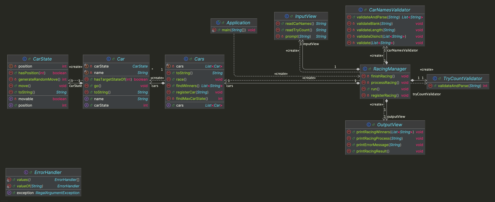

# java-racingcar-7


---

# 프로젝트 개요

## 프로젝트 구조

```plaintext
└── racingcar
    ├── Application.java
    ├── controller
    │ └── RacingManager.java
    ├── domain
    │ ├── Car.java
    │ ├── CarState.java
    │ └── Cars.java
    ├── handler
    │ └── ErrorHandler.java
    ├── validator
    │ ├── CarNamesValidator.java
    │ └── TryCountValidator.java
    └── view
        ├── InputView.java
        └── OutputView.java
```


---

## 프로젝트 다이어그램


