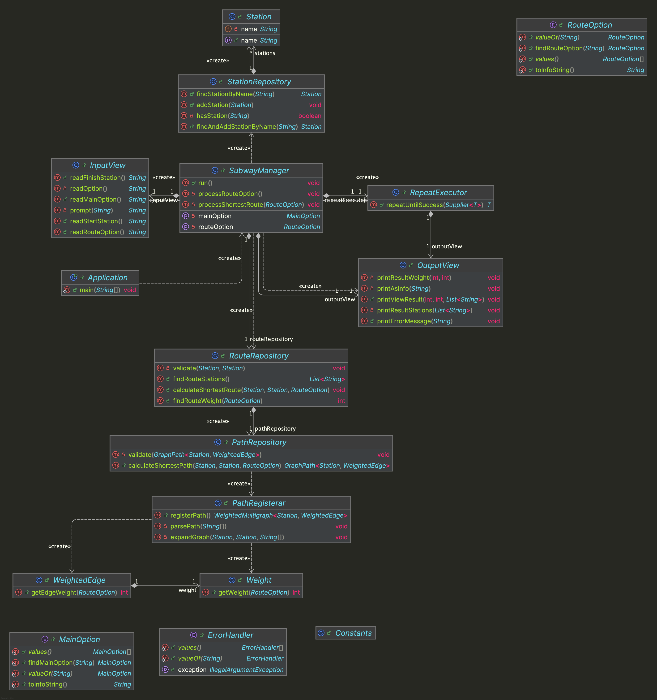

# java-subway-path-precourse


---

# 프로젝트 개요

## 프로젝트 구조

```plaintext
└── subway
    ├── Application.java
    ├── controller
    │ └── SubwayManager.java
    ├── domain
    │ ├── PathRepository.java
    │ ├── RouteRepository.java
    │ ├── Station.java
    │ ├── StationRepository.java
    │ ├── Weight.java
    │ ├── WeightedEdge.java
    │ └── menu
    │     ├── MainOption.java
    │     └── RouteOption.java
    ├── handler
    │ └── ErrorHandler.java
    ├── util
    │ ├── Constants.java
    │ ├── PathRegisterar.java
    │ └── RepeatExecutor.java
    └── view
        ├── InputView.java
        └── OutputView.java
```


---

## 프로젝트 다이어그램




---

# 구현할 기능 목록

## 🗂️ Domain

### MainOption
- [ ] 메인 메뉴 옵션 관련 정보를 처리한다.

### RouteOption
- [ ] 경로 메뉴 옵션 관련 정보를 처리한다.

### PathRepository
- [ ] 지하철 노선 관련 정보를 처리한다.
  - [ ] 지하철 노선 정보를 등록하도록 한다.
  - [ ] 지하철 노선의 최단 경로를 구한다.
  - [ ] 연결된 지하철 노선의 유효성을 판단한다.
    - [ ] [예외] 연결된 노선이 존재하지 않는 경우, 예외를 발생시킨다.

### RouteRepository
- [ ] 지하철 경로 관련 정보를 처리한다.
  - [ ] 선택한 경로 옵션 메뉴에 해당하는 최단 경로를 계산한다.
  - [ ] 선택한 경로 옵션 메뉴에 해당하는 경로의 크기를 계산한다.
  - [ ] 계산한 경로에 해당하는 지하철역들의 이름을 구한다.
  - [ ] 출발역과 도착역의 유효성을 판단한다.
    - [ ] [예외] 출발역과 도착역이 같은 경우, 예외를 발생시킨다.

### Station
- [ ] 지하철 역에 대한 정보를 처리한다.

### StationRepository
- [ ] 지하철 역들의 대한 정보를 처리한다.
  - [ ] 지하철 역을 추가한다.
  - [ ] 지하철 역 이름으로 지하철 역을 찾는다.
    - [ ] [예외] 지하철 역 이름에 해당하는 지하철 역이 없는 경우, 예외를 발생시킨다.
  - [ ] 지하철 역 이름으로 지하철 역을 찾고 추가한다.
  - [ ] 지하철 역 이름에 해당하는 지하철 역의 존재 여부를 판단한다.

### Weight
- [ ] 간선의 무게에 대한 정보를 처리한다.
  - [ ] 경로 메뉴 옵션에 따라 간선의 무게로 계산한 값(거리 또는 시간)을 구한다.

### WeightedEdge
- [ ] 무게가 있는 간선에 대한 정보를 처리한다.
  - [ ] 경로 메뉴 옵션에 따른 간선의 무게를 구한다.


---

## 👀 View

### InputView
- [ ] 입력 기능을 처리한다.
  - [ ] 메인 메뉴 옵션을 입력받는다.
  - [ ] 경로 메뉴 옵션을 입력받는다.
  - [ ] 출발역을 입력받는다.
  - [ ] 도착역을 입력받는다.

### OutputView
- [ ] 출력 기능을 처리한다.
  - [ ] 에러 발생시 에러 관련 메시지를 출력한다.
  - [ ] 조회 결과를 출력한다.
  - [ ] 지하철 경로 결과를 출력한다.
    - [ ] 결과는 `[INFO]`로 시작하도록 출력한다.


---

## 🕹️ Controller

### SubwayManager
- [ ] 지하철 경로 계산 과정을 처리한다.


---

## 🛠 Handler

### ErrorHandler
- [ ] 잘못된 입력 시 오류 메시지를 출력하고 재입력을 유도한다.
  - [ ] 잘못된 입력 시 IllegalArgumentException 예외를 발생시킨다.
  - [ ] 오류 메시지는 `[ERROR]`로 시작하도록 한다.


---

## ⚙️ Util

### Constants
- [ ] 지하철 경로 관련 상수를 저장한다.

### PathRegisterar
- [ ] 지하철 노선에 대한 정보를 등록한다.

### RepeatExecutor
- [ ] 입력이 성공할 때까지 재입력을 받는다.
  - [ ] IllegalArgumentException 예외 발생시 재입력을 받는다.
