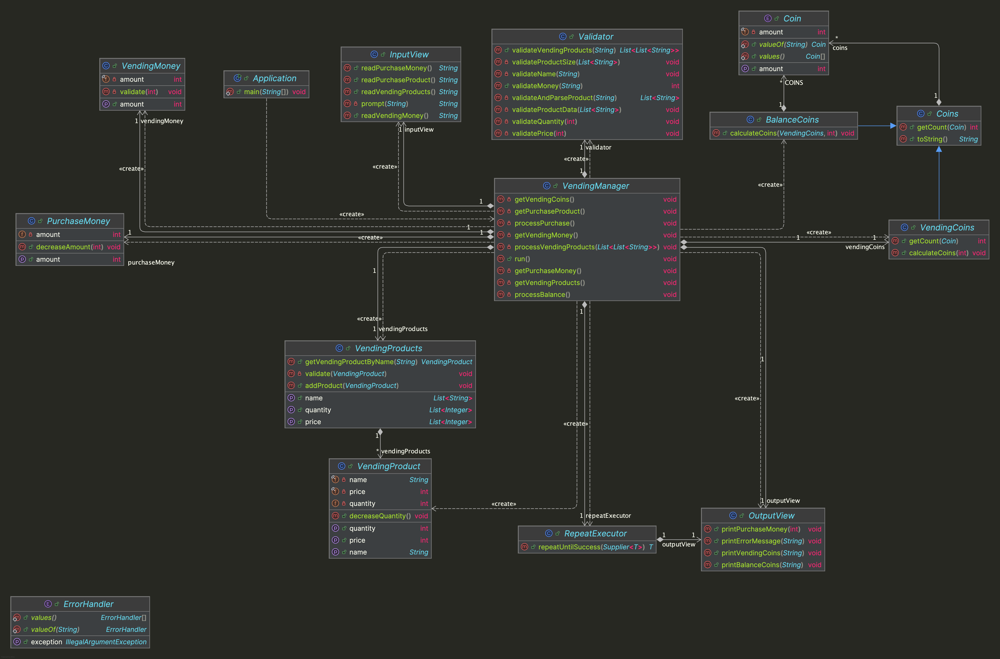

# java-vendingmachine-precourse


---

# 프로젝트 개요

## 프로젝트 구조

```plaintext
└── vendingmachine
    ├── Application.java
    ├── controller
    │ └── VendingManager.java
    ├── domain
    │ ├── BalanceCoins.java
    │ ├── Coin.java
    │ ├── Coins.java
    │ ├── PurchaseMoney.java
    │ ├── VendingCoins.java
    │ ├── VendingMoney.java
    │ ├── VendingProduct.java
    │ └── VendingProducts.java
    ├── handler
    │ ├── ErrorHandler.java
    │ └── Validator.java
    ├── util
    │ └── RepeatExecutor.java
    └── view
        ├── InputView.java
        └── OutputView.java
```


---

## 프로젝트 다이어그램




---

# 구현할 기능 목록

## 🗂️ Domain

### Coin
- [ ] 500원, 100원, 50원, 10원 단위의 동전 정보를 처리한다.

### Coins
- [ ] 동전별 개수를 저장한다.

### VendingCoins
- [ ] 자판기가 보유한 금액의 동전 개수를 반환한다.
- [ ] 자판기가 보유한 금액을 동전으로 환전하도록 계산한다.

### BalanceCoins
- [ ] 잔고 금액을 동전으로 환전하도록 계산한다.
  - [ ] 환전하지 않은 잔고 금액이 최소 동전 단위(10원)보다 적을 때까지 환전한다.
  - [ ] 환전할 동전 단위를 무작위로 선택한다.
  - [ ] 무작위로 선택한 동전 단위로 1개 이상 환전될 수 있을 때 환전한다.
  - [ ] 동전 단위로 나눈 동전의 개수가 현재 남아 있는 자판기의 동전의 개수를 초과하지 않도록 환전한다.
  - [ ] 동전으로 환전한 금액만큼 환전하지 않은 잔고 금액을 차감한다.

### VendingMoney
- [ ] 투입 금액을 저장한다.
- [ ] 투입 금액의 유효성을 검증한다.
  - [ ] [예외] 투입 금액이 최소 동전 단위(10원)으로 나누어 떨어지지 않는 경우, 예외를 발생시킨다.

### VendingProduct
- [ ] 자판기 상품의 상품명, 가격, 수량을 저장한다.
- [ ] 자판기 상품의 수량을 1개 감소시킨다.
-  [ ] [예외] 현재 남아있는 자판기 상품의 수량이 없는 경우, 예외를 발생시킨다.

### VendingProducts
- [ ] 자판기 상품 목록을 저장한다.
- [ ] 자판기 상품에 대한 정보를 상품명으로 찾는다.
  - [ ] [예외] 찾는 상품명이 없는 경우, 예외를 발생시킨다.
- [ ] 자판기 상품 목록에 새로운 자판기 상품을 추가한다.
  - [ ] [예외] 자판기 상품 목록에 이미 상품이 존재하는 경우, 예외를 발생시킨다.

---

## 👀 View

### InputView
- [ ] 입력 기능을 처리한다.
  - [ ] 자판기가 보유하고 있는 금액을 입력받는다.
  - [ ] 상품명과 가격, 수량을 입력받는다.
  - [ ] 투입 금액을 입력받는다.
  - [ ] 구매할 상품명을 입력받는다.

### OutputView
- [ ] 출력 기능을 처리한다.
  - [ ] 에러 발생시 에러 관련 메시지를 출력한다. 
  - [ ] 자판기가 보유한 동전을 출력한다.
  - [ ] 투입 금액을 출력한다.
  - [ ] 잔돈을 출력한다.


---

## 🕹️ Controller

### VendingManager
- [ ] 현재 자판기가 보유한 금액을 읽는다.
- [ ] 현재 자판기가 보유한 금액을 동전으로 환전한다.
- [ ] 현재 자판기가 보유한 상품들의 정보(상품명, 가격, 수량)를 읽는다.
- [ ] 자판기에 투입할 금액을 읽는다.
- [ ] 자판기에서 구매할 상품명을 읽는다.
  - [ ] 자판기 상품 중 최저 가격보다 투입 금액이 적거나 총 상품 수량이 0일 때까지 반복한다.
- [ ] 잔고를 계산한다.
  - [ ] 남은 투입 금액을 동전으로 환전한다.


---

## 🛠 Handler

### ErrorHandler
- [ ] 잘못된 입력 시 오류 메시지를 출력하고 재입력을 유도한다.
  - [ ] 잘못된 입력 시 IllegalArgumentException 예외를 발생시킨다.

### Validator
- [ ] 금액(자판기 보유 금액, 투입 금액)의 유효성을 검증한다.
- [ ] 자판기 상품들의 상품명과 수량, 가격의 유효성을 검증한다.


---

## ⚙️ Util

### RepeatExecutor
- [ ] IllegalArgumentException 예외 발생시 재입력을 받는다.
